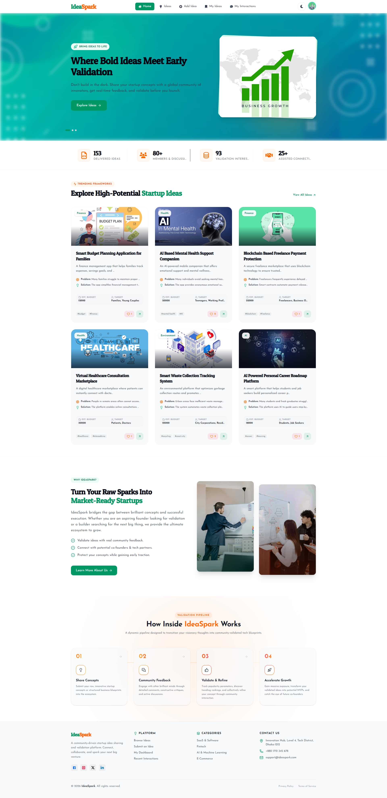

# IdeaSpark

### Validate Your Innovation Ideas

A modern, collaborative web platform where entrepreneurs and innovators can **share, validate, and refine startup ideas** through community engagement, real-time feedback, and interactive discussions.

---

## 📸 Preview

---

## 🚀 About IdeaSpark

IdeaSpark is a web-based platform designed to foster innovation and entrepreneurship. Instead of traditional booking or scheduling systems, IdeaSpark focuses on **idea validation and community-driven collaboration**, allowing users to:

- 💡 Share innovative startup ideas with the world
- 🔍 Explore trending and emerging ideas from the community
- 💬 Provide constructive feedback through comments and discussions
- ❤️ Support ideas through likes and reactions
- 🎯 Connect with potential co-founders and tech partners
- 📊 Track engagement metrics and idea performance
- ✨ Refine concepts collectively with community input

---

## ✨ Key Features

<b>🔐 User Authentication & Profiles</b>

- Secure authentication with **Better Auth**
- Google OAuth integration for quick signup
- User profile management with avatars and metadata
- Password reset functionality via email
- Secure session management

<b>💡 Idea Management</b>

- **Create & Share Ideas** — Post detailed startup concepts with descriptions, target markets, and solutions
- **Browse Ideas** — Discover ideas with advanced search and filtering
- **Trending Section** — Auto-curated trending ideas displayed on homepage
- **Full CRUD** — Edit and delete your own ideas anytime
- **Idea Cards** — Beautiful, interactive cards with key engagement metrics

<b>🎯 Idea Details & Engagement</b>

- Comprehensive idea pages with title, description, category, target market, estimated budget, and proposed architecture
- One-click **Like System** to support ideas
- Real-time engagement metrics (likes, comments, views)

<b>💬 Community Interaction</b>

- Leave, edit, and delete comments on any idea
- Engage in real-time discussions
- View all your interactions from the **My Interactions** dashboard
- Provide and receive constructive feedback

<b>🔎 Discovery & Filtering</b>

- **Category Filtering** — Tech, Health, AI, Education, Finance, Environment, and more
- **Full-text Search** across all ideas
- **Sorting Options** — Trending, Newest, Most Popular
- **Pagination** for smooth browsing

<b>👤 User Dashboard</b>

- **My Ideas** — Central hub for managing your submitted ideas
- **My Profile** — View and edit personal information
- **Statistics Dashboard** — Track performance and engagement
- **Interaction Tracker** — Monitor comments, likes, and feedback history

<b>🌙 UI/UX Highlights</b>

- Dark / Light mode with automatic detection and manual toggle
- Fully responsive design (Mobile, Tablet, Desktop, Large Screens)
- Framer Motion-powered smooth animations and micro-interactions
- Skeleton loading screens and graceful error handling
- Semantic HTML and ARIA labels for accessibility

---

## 🛠️ Tech Stack

### Frontend

| Technology | Version | Purpose |
|---|---|---|
| Next.js | 16.2.6 | React framework with SSR |
| React | 19.2.4 | UI library |
| TailwindCSS | 4 | Utility-first CSS |
| Framer Motion | 12.38.0 | Animations |
| React Hook Form | 7.76.0 | Form state management |
| Axios | 1.16.1 | HTTP client |
| React Icons | 5.6.0 | Icon library |
| Lucide React | 1.16.0 | Icon set |

### Backend

| Technology | Version | Purpose |
|---|---|---|
| Better Auth | 1.6.11 | Authentication system |
| MongoDB | 7.2.0 | Document database |
| SweetAlert2 | 11.26.24 | Alerts & modals |

### Dev Tools

| Tool | Purpose |
|---|---|
| ESLint 9 | Code linting |
| PostCSS 4 | CSS processing |
| Babel | JavaScript compilation |

---

## 🔒 Security

- Secure authentication via Better Auth library
- Server-side and client-side **protected routes**
- Secure session handling
- CORS configured for API communication
- Input validation with React Hook Form

---

## 📱 Responsive Breakpoints

| Breakpoint | Range |
|---|---|
| Mobile | 640px and below |
| Tablet | 641px – 1024px |
| Desktop | 1025px – 1920px |
| Large Screens | 1920px and above |

---

## 🌐 Deployment

The application is deployed on **Vercel**. It can also be hosted on any Node.js-compatible platform:

- Heroku
- Railway
- Netlify
- AWS
- DigitalOcean

---

## 💡 Future Enhancements

- [ ] Notifications system
- [ ] User messaging / DMs
- [ ] Idea investment integration
- [ ] Advanced analytics dashboard
- [ ] Team collaboration features
- [ ] Idea templates and guides
- [ ] Payment system integration
- [ ] Mobile app (React Native)
- [ ] AI-powered idea recommendations
- [ ] Blockchain-based idea ownership

---

## 🐛 Bug Reports & Feature Requests

Please open an issue on the GitHub repository for any bugs or feature suggestions.

## 📧 Contact

For support, email us at **support@ideaspark.com** or visit the [live site](https://idea-spark-zeta-wine.vercel.app).

---

## 👨‍💻 Developer

**Ziaul Hoque**
- GitHub: [@ziaulhoquepatwary](https://github.com/ziaulhoquepatwary)